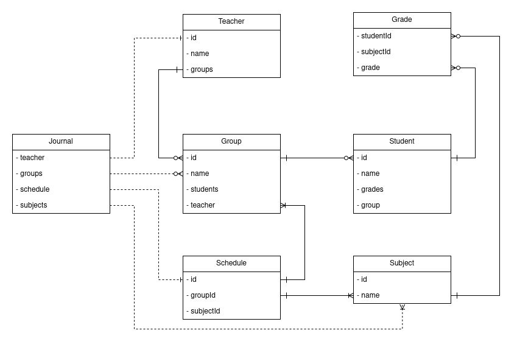

# JavaIO

## diagrams

# Задача
* **Создать приложение классного журнала со следующими основными классами.**
    * **Студент**
    * **Преподаватель**
    * **Предмет**

* **Первичные данные считать из файлов формата** ***.xlsx***
* **Данные необходимо сериализовать в формате** ***JSON/XML***
* **Предусмотреть десериализацию данных и работу с этими данными**

# Теоретическая справка

**Streams -** Это потоки, в контексте изучения **Java IO** мы рассматриваем потоки *"Ввода" - Input* и *"Вывода" - Output*.

**InputStream -** Это входной поток, в нём мы можем считывать данные из потока (из файлов например). Пример - *read()*.
**OutputStream -** Это выходной поток, в нём мы можем передавать данные в поток (в файл например). Пример - *write(x)*.

## Последовательность работы с потоком

* **Создаём поток.**
* **Открываем поток.** *FileInputStream fis = new FileInputStream("fileName");* (здесь создание и запись)
* **Читаем данные из потока (Или записываем).** *i = fis.read()*
* **Закрываем поток.** *fis.close();*

## Сериализация и десериализация

### Сериализация - запись объектов в поток.
- Интерфейс **ObjectOutputextends DataOutput**
- Класс **ObjectOutputStream**
- Метод **writeObject(object)**
- Исключение **NotSerializableException**

### Десериализация - чтение объекта из потока.
- Интерфейс ObjectInput extends DataInput
- Класс ObjectInputStream
- Метод readObject()
- Исключение:
  - ClassNotFoundException
  - InvalidClassException

### С какими типами файлов работать?
Самыми яркими примерами файлов для сериализации, с которыми работаем, в данном случае являются:
- **JSON**
- **XML**
- **CSV, TSV**
